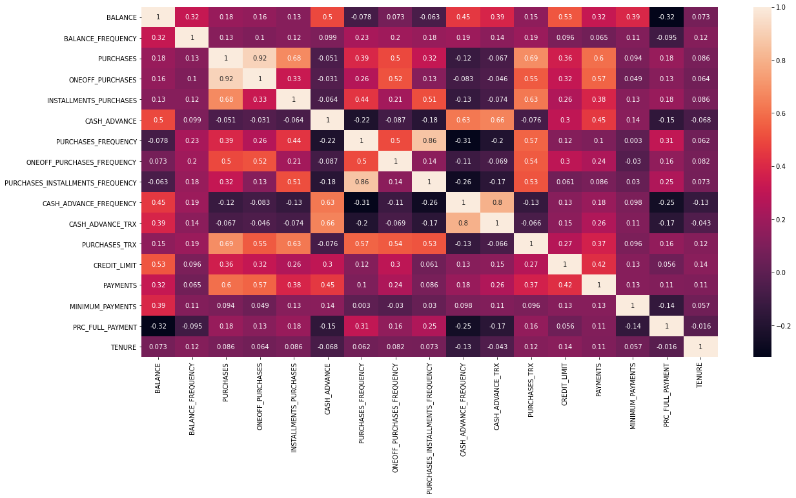

# customer-segmentation-with-unsupervised-learning

This project based on Customer-market segmentation Using unsupervised Clustering techniques.  
- **KMeans Clustering (Elbow Method)**

Dataset : [Customers Data](Data Source: https://www.kaggle.com/arjunbhasin2013/ccdata)

***

### Tools and Techniques used  
  
- numpy
- pandas
- matplotlib
- seaborn
- scikitlearn
- KMeans Clustering
- PCA (Principal Component Analysis)

***
### Project Structure  

  

***
### Data Analysis: Correlations
 

***
### Data Analysis : KDE
 
